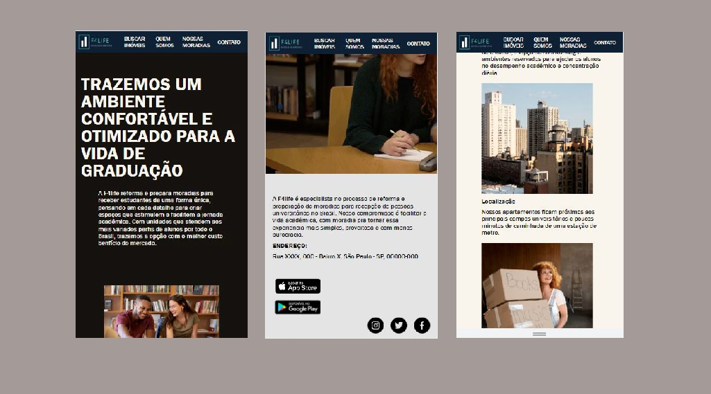
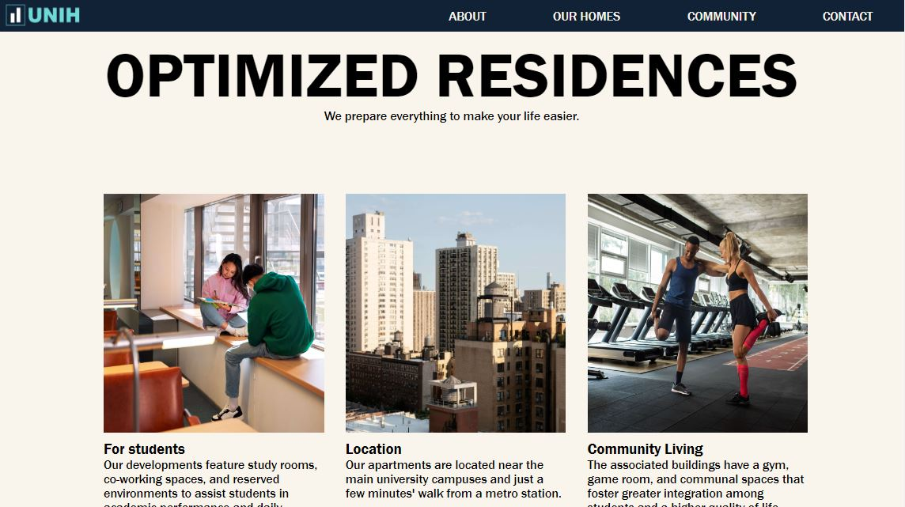
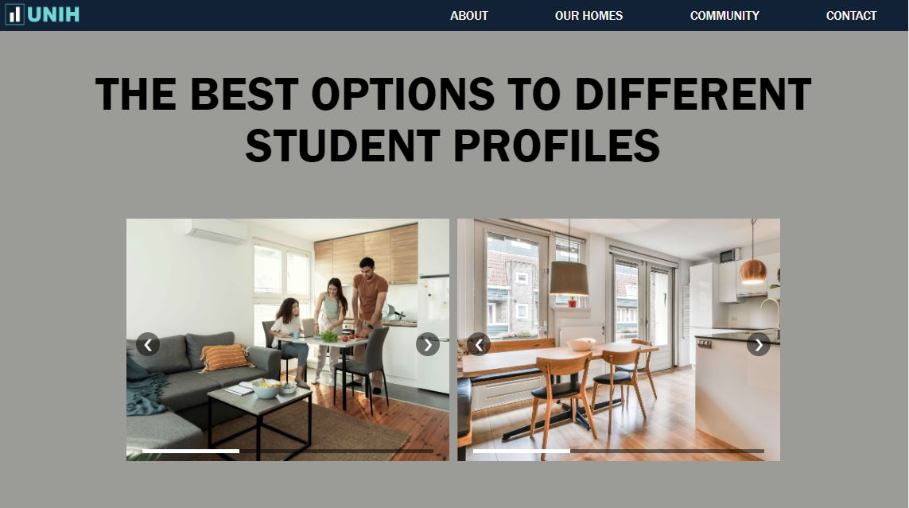

# [Landing Page](https://landingpage-joaoneiva.surge.sh/)

  

## About:
The goal of this project was to create the front-end of a responsive webpage that responds to user interactions, for a fictional company focusing on university housing.

## Functionalities:
- [x]  Have different sections e links to external social media
- [x]  Parallax effect to give a depth ilusion
- [x]  Animation on texts and images
- [x]  Hamburguer menu for mobile
- [x]  Image slider
- [x]  Loading Page
- [x]  Responsiveness
- [x]  Elements that change with mouse on hover and scrolling
- [x]  Smooth scroll effect
- [x]  Smooth section transition

## Deploy:
https://landingpage-joaoneiva.surge.sh/

## Technologies used:
- HTML
- CSS
- JavaScript
- DOM
- GSAP

## Images:

    
    
    
    

